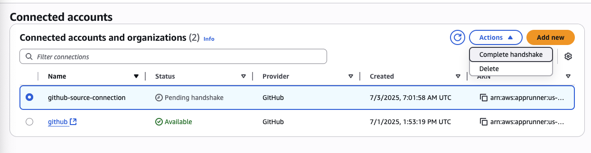

# CloudFront HTTP/3 Distribution with App Runner Backend

This repo implements a CloudFront distribution with HTTP/3 support, forwarding requests to an AWS App Runner backend. The setup provides the fastest possible web connection speeds using the latest HTTP/3 protocol.

## Architecture

- **CloudFront Distribution** - HTTP/3 enabled CDN with global edge locations
- **AWS App Runner** - Backend service running Express.js application
- **No Caching** - All requests forwarded directly to origin for dynamic content

## Protocol Support

- ✅ **HTTP/3** - Primary protocol (fastest, uses QUIC over UDP)
- ❌ **HTTP/2** - Disabled  
- ✅ **HTTP/1.1** - Fallback for older clients

## Testing HTTP/3

### Method 1: Using quiche-client (Recommended)

Install Cloudflare's HTTP/3 client:
```bash
brew install cloudflare-quiche
```

Test HTTP/3 connection:
```bash
# Basic test
quiche-client --method POST https://d100w0lleku9em.cloudfront.net/upload

# Detailed JSON output
quiche-client --method POST --dump-json https://d100w0lleku9em.cloudfront.net/upload
```

### Method 2: Using curl (HTTP/1.1 fallback)

Regular curl will fall back to HTTP/1.1 since most curl builds don't have HTTP/3 support:
```bash
curl -v -X POST https://d100w0lleku9em.cloudfront.net/upload
```

### Method 3: Browser Testing

Modern browsers with HTTP/3 support:
- **Chrome**: Enable `chrome://flags/#enable-quic`
- **Firefox**: Set `network.http.http3.enabled` to `true` in `about:config`
- **Safari**: HTTP/3 supported in recent versions

Check browser dev tools > Network tab > Protocol column to see "h3" for HTTP/3 connections.

## How to Detect HTTP/3 is Working

### 1. Check Alt-Svc Header
HTTP/3 is advertised via the `Alt-Svc` header:
```
Alt-Svc: h3=":443"; ma=86400
```
This tells clients that HTTP/3 is available on port 443.

### 2. Protocol Identification

**HTTP/3 (quiche-client)**:
- Request uses HTTP/3 frame format: `:method`, `:scheme`, `:authority`, `:path`
- Response status: `:status: 200`

**HTTP/1.1 (curl fallback)**:
- Request: `POST /upload HTTP/1.1`
- Response: `HTTP/1.1 200 OK`

### 3. Connection Details

**HTTP/3 Success Indicators**:
- Uses QUIC protocol (UDP-based)
- Faster connection establishment
- Built-in encryption (no separate TLS handshake)
- Better performance on mobile/poor networks

**HTTP/1.1 Fallback Indicators**:
- Uses TCP connection
- Separate TLS handshake visible in verbose output
- `ALPN: server did not agree on a protocol. Uses default.`

## Expected Response

Both HTTP/3 and HTTP/1.1 should return:
```
hello world
```

## Deployment

Deploy the CloudFront distribution:
```bash
sst deploy
```

## Endpoints

- **Direct App Runner**: `https://nrfzytm7by.us-east-1.awsapprunner.com/upload`
- **CloudFront (HTTP/3)**: `https://d100w0lleku9em.cloudfront.net/upload`

The CloudFront URL provides HTTP/3 support with global edge locations for optimal performance.

# AppRunner

## GitHub Connection

- either use existing connection
- or create new one

You need to manually finish the handshake
